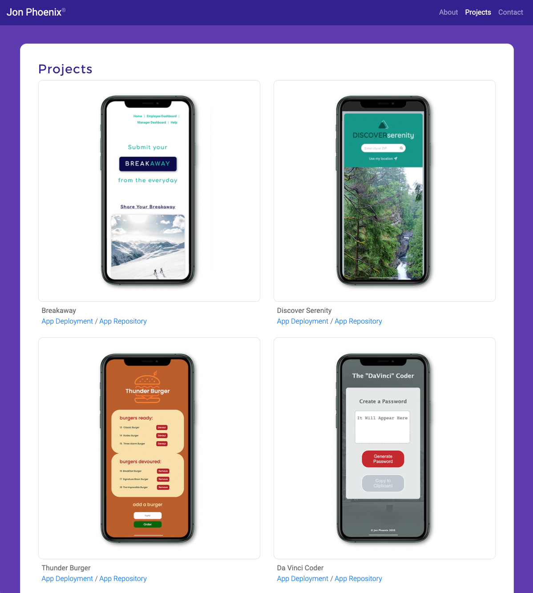
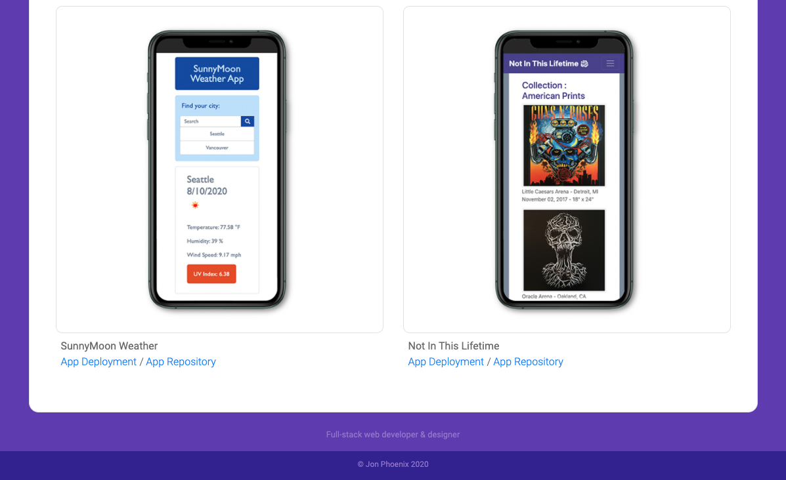

# Jon Phoenix - Portfolio

Presenting my portfolio as a full-stack web developer. The application delivers an extended structure comprised by home, about, portfolio galleries, and contact pages, including functional links to social media and a downloadable resume in pdf file.

This portfolio contains a collection of web applications featuring JavaScript, HTML, CSS, APIs, MySQL, Sequelize and responsive UI design across viewports. Also features [**"Discover Serenity"**](https://calebkirkish.github.io/discover-serenity/) and [**Breakaway**](https://breakaway-vacay.herokuapp.com/), two robust web applications created in collaboration with [**MVC-5**](https://github.com/MVC-5) team of developers.

Each project offers a link to the deployed online version and a link to the github repository.


Deployment url: https://jonphoenix.github.io/phoenix-portfolio/


## Responsive Application Features

```
• Functional deployment - desktop and mobile
• Consistent fixed-at-the-top Navbar on each page
• Responsive web design across viewports in layout and images
• Functioning navigation links to home, about, portfolio and contact pages
• "Hamburger" toggler and dropdown menu for small viewports

• Proper Bootstrap components using the grid system
• Containers / Rows / Columns / Sub-Rows / Sub-Columns
• Sticky Footer – elegant and responsive across viewports
• Contact form with functional message input and flexible message box
```

## Code Features

```
• Logical HTML structure with tags and attributes in sequential order
• Accessibility standards with detailed comments and alt attributes
• Curated indentation and all links functioning correctly
• Detailed HTML elements semantic in the source code
• CSS Stylesheet coordinated with all HTML files
• Each page has valid and correct HTML code
```

## Application Preview





